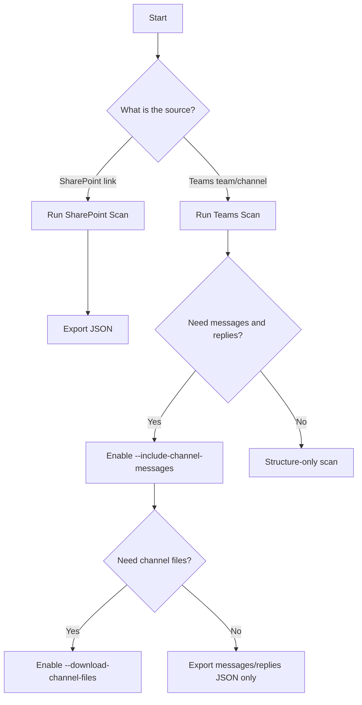

# Tools Overview

Use this page to quickly decide whether to run the SharePoint scanner or the Teams scanner.

## Quick Decision

- If your source is a **SharePoint folder/file link**, use [SharePoint Scan](sharepoint-scan.md).
- If your source is **Teams teams/channels/messages/replies**, use [Teams Scan](teams-scan.md).
- If you need **files stored in Teams channels**, still use the Teams scanner with file download enabled.

## Decision Flow

## Recommended Execution Order

1. Start with a small scope (low limits, single target).
2. Confirm permissions and output structure.
3. Scale up and save final outputs in `analyses/`.
