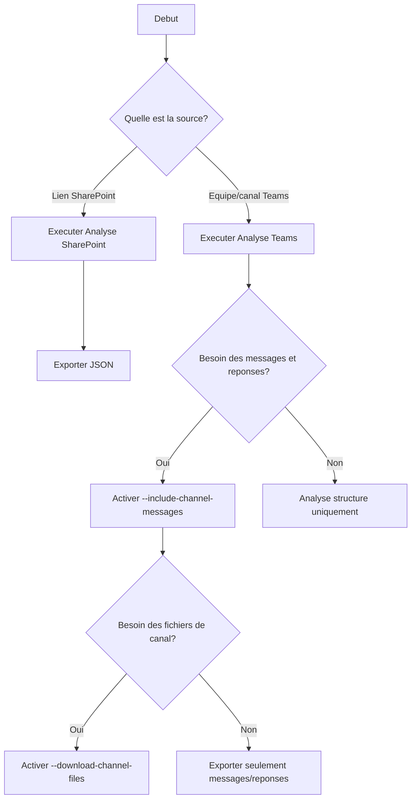

# Vue d'ensemble des outils

Cette page vous aide a choisir rapidement entre l'analyseur SharePoint et l'analyseur Teams.

## Choix rapide

- Si votre source est un **lien dossier/fichier SharePoint**, utilisez [Analyse SharePoint](sharepoint-scan.md).
- Si votre source est **Teams (equipes/canaux/messages/reponses)**, utilisez [Analyse Teams](teams-scan.md).
- Si vous avez besoin des **fichiers dans les canaux Teams**, utilisez aussi l'outil Teams avec telechargement active.

## Flux de decision

## Ordre d'execution recommande

1. Commencez avec une petite portee (limites faibles, cible unique).
2. Verifiez les permissions et la structure de sortie.
3. Etendez la portee puis sauvegardez les sorties dans `analyses/`.
