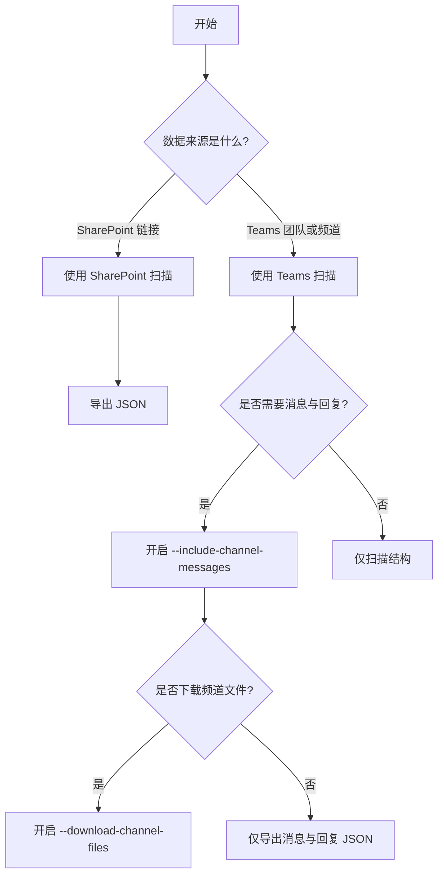

# 工具总览

本页面帮助你快速判断何时使用 SharePoint 扫描工具，何时使用 Teams 扫描工具。

## 快速选择

- 如果你的输入是 **SharePoint 文件夹/文件链接**，请使用 [SharePoint 扫描](sharepoint-scan.md)。
- 如果你的输入是 **Teams 团队、频道、消息与回复**，请使用 [Teams 扫描](teams-scan.md)。
- 如果你需要 **Teams 频道内文件**，也应使用 Teams 扫描（可开启下载文件选项）。

## 决策流程

## 推荐执行顺序

1. 先做小范围验证（低 limit、单一目标）。
2. 确认权限与结果结构后，再扩大范围。
3. 最后统一整理 JSON 输出到 `analyses/` 目录。
